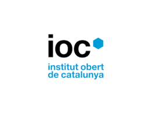

  
  
  # Curso de Especialización en Inteligencia Artificial y Big Data
  
  
  
  
  

---

## 🎯 Sobre este repositorio

Este repositorio contiene los proyectos, ejercicios y trabajos desarrollados durante el **Curso de Especialización en Inteligencia Artificial y Big Data (CEFP)** en el **Institut Obert de Catalunya (IOC)**.

## 📚 Información del curso

<table>
<tr>
<td>

**🏢 Institución**: IOC - Institut Obert de Catalunya  
**📖 Programa**: Curso de Formación Profesional de Especialización  
**🎓 Título**: Inteligencia Artificial y Big Data  
**💻 Modalidad**: Online  
**🔗 Enlace oficial**: [CE IA y Big Data - IOC](https://ioc.xtec.cat/educacio/ce-ia-bigdata)

</td>
<td>
  
   
  
</td>
</tr>
</table>

## 🗂️ Estructura del curso

- 🧠 **Módulo 1**: Modelos de IA
- 🤖 **Módulo 2**: Sistemas de aprendizaje automático
- 💻 **Módulo 3**: Programación de Inteligencia Artificial
- 📊 **Módulo 4**: Sistemas de BigData
- 🔬 **Módulo 5**: Big data aplicado
- 🚀 **Módulo 6**: Proyecto de IA y Big Data

## 👩‍💼 Perfil profesional

### 🎓 Formación académica
- **Grado en Psicología** - Universidad de las Islas Baleares (UIB)
- **FP Grado Superior en Desarrollo de Aplicaciones Web** - Institut Pedralbes, Barcelona
- **Curso de Especialización en IA y Big Data** - IOC (en curso)

### 🌐 Conexión profesional

## 🛠️ Tecnologías y herramientas

| **Lenguajes** | **Frameworks & Libraries** | **Tools & Platforms** |
|:---:|:---:|:---:|
|  |  |  |
| |  |  |
| |  |  |
| |  | |

## 🎯 Objetivos del curso

- ✅ Diseñar e implementar soluciones basadas en IA
- ✅ Analizar y procesar grandes volúmenes de datos
- ✅ Desarrollar modelos de Machine Learning y Deep Learning
- ✅ Aplicar técnicas de IA en diferentes sectores industriales
- ✅ Evaluar éticamente el impacto de las tecnologías de IA

## 📁 Estructura del repositorio

| Carpeta | Descripción |
|---------|-------------|
| 📁 **m1/** | Modelos de IA |
| 📁 **m2/** | Sistemas de aprendizaje automático |
| 📁 **m3/** | Programación de Inteligencia Artificial |
| 📁 **m4/** | Sistemas de BigData |
| 📁 **m5/** | Big data aplicado |
| 📁 **m6/** | Proyecto de IA y Big Data |
| 📁 **recursos/** | Material de apoyo |

## 📞 Contacto

---

  
    🔄 <em>Este repositorio se actualiza regularmente con el progreso del curso y nuevos proyectos desarrollados.</em>
  
   
  
    ⭐ Si este contenido te resulta útil, ¡no dudes en darle una estrella!
  

